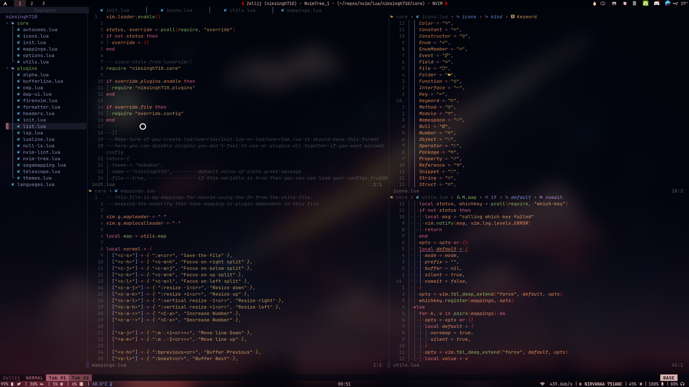
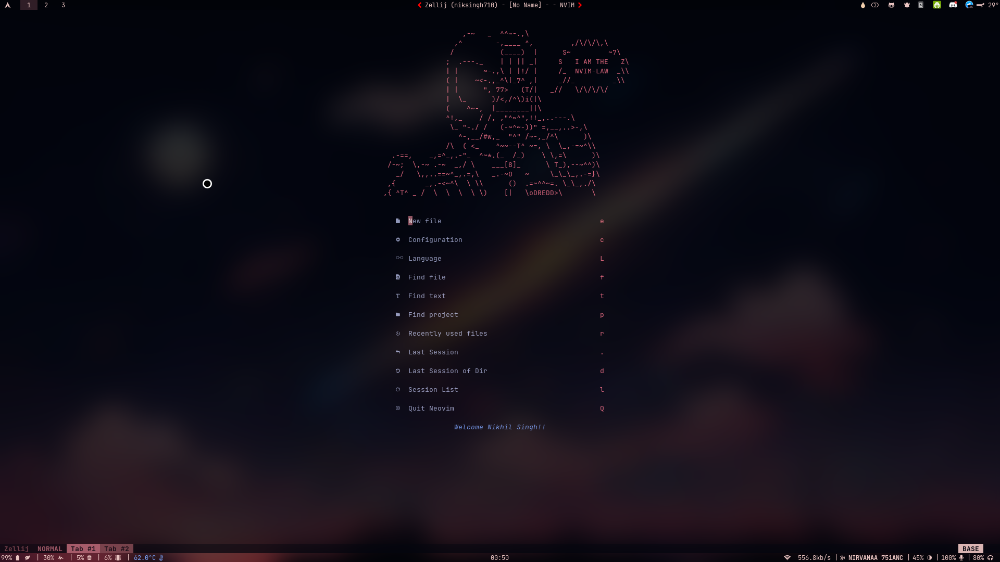

# Neovim

Highly inspired by the lunarvim config.......




## Override

This is a dir that can be crated under `lua/` 
This may contain a file structure like this

`~/.config/nvim/lua/override/`

```lua
return {
  file = false, -- if this is true then config.lua in ~/.config/nvim/lua/override/ will be sourced
  name = "Nikhil Singh", -- name to be shown on alpha
  plugins = { 
    enable = true, -- make it false if you want to disable plugins and only wanna work with default 
    list = {
      -- put plugins name to disable e.g folke/which-key.nvim = `which_key = false`
      -- which_key = true,
      -- dressing = false,
      -- telescope = false,,
      copilot = true, -- these are recomended to disable
      copilot_cmp = true,
      calender = true,
    }
  },
}
```


# My keymaps are intutive and easy to remember

checkout them by `:Telescope keymaps` or by pressing `<leader> + sk`

## INSTALL

```
mv ~/.config/nvim ~/.config/nvim.bak
git clone https://github.com/niksingh710/nvim ~/.config/nvim
```

## Keymaps

can you write the keymaps from the old Readme file?

| Keymap          | Description          |
| --------------- | -------------------- |
| jk              | To exit insert mode  |
| kj              | To exit insert mode  |
| `<c-s>`         | Save                 |
| `<leader> + q`  | Quit                 |
| `<leader> + e`  | Toggle the file tree |
| `<leader> + s`  | Search               |
| `<leader> + lf` | Format               |
| `<leader> + sk` | Keymap Search        |

This much should get you going and extra is all what you discover (fire.nvim) 

### LEADER = SPACE

## 🗒️NOTE

As i have COPILOT access i have added it as a plugin in [list.lua](./nvim/lua/niksingh710/list.lua)
if you want to disable it comment it out in that file
