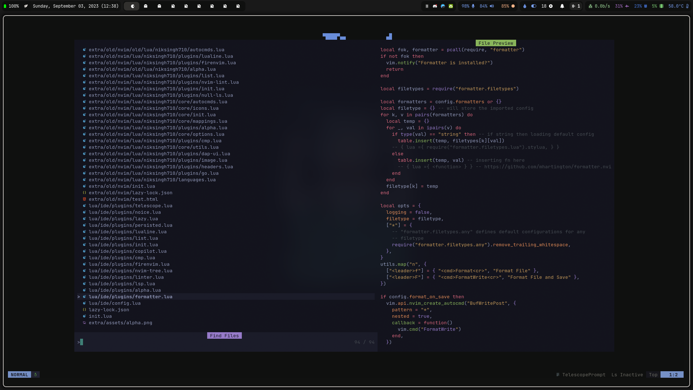
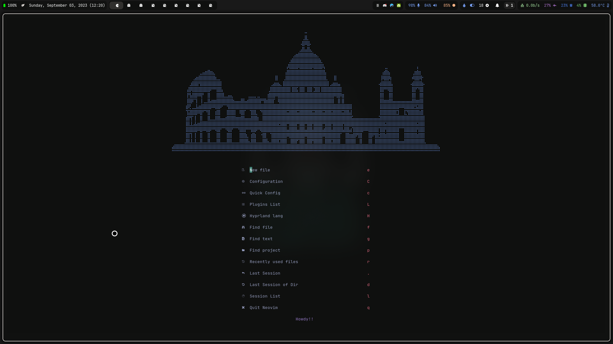

# Nvim

[](LICENSE)
[](https://github.com/niksingh710/nvim/stargazers)
[](https://github.com/niksingh710/nvim/network/members)
[](https://github.com/niksingh710/nvim)
[](https://github.com/niksingh710/nvim/commits/master)
[](https://github.com/niksingh710/nvim/issues)
[](https://github.com/niksingh710/nvim/pulls)

### Installation

To install your Neovim configuration, you can follow these steps:

1. Clone the repository into your Neovim config directory:

```bash
git clone https://github.com/niksingh710/nvim ~/.config/nvim
```

2. Make sure you have the required tools and dependencies installed using `yay`:

```bash
yay -S --needed \
   neovim python-pynvim nodejs npm ripgrep fzf fd bat treesitter-cli curl ueberzugpp imagemagick lua51
```

The below command makes sure you have magick installed that is required by [image.nvim](https://github.com/3rd/image.nvim)
```bash
luarocks --local --lua-version=5.1 install magick
```

### Preview

You've provided preview images for some of the plugins you've configured:

#### Telescope



#### Alpha



#### Lualine


## Keymaps

can you write the keymaps from the old Readme file?

| Keymap          | Description          |
| --------------- | -------------------- |
| `jk`            | To exit insert mode  |
| `kj`            | To exit insert mode  |
| `<c-s>`         | Save                 |
| `<leader> + q`  | Quit                 |
| `<leader> + e`  | Toggle the file tree |
| `<leader> + s`  | Search               |
| `<leader> + lf` | Format               |
| `<leader> + sk` | Keymap Search        |

This much should get you going and extra is all what you discover (fire.nvim) 

## Configuration Structure

The configuration and plugins are structured in an organized manner, with Lua scripts stored in the `lua` directory. This modular approach ensures a clean and maintainable Neovim setup.

Feel free to explore and customize these scripts to tailor your Neovim environment to your preferences.

If you have any questions or need further assistance with your Neovim configuration, please don't hesitate to reach out.


