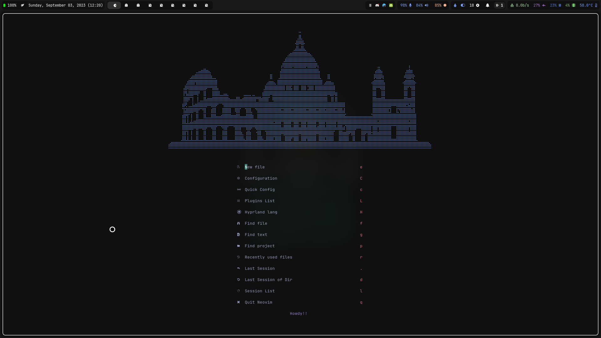

### Installation

To install your Neovim configuration, you can follow these steps:

1. Clone the repository into your Neovim config directory:

```bash
git clone https://github.com/niksingh710/nvim ~/.config/nvim
```

2. Make sure you have the required tools and dependencies installed using `yay`:

```bash
yay -S --needed \
   neovim python-pynvim nodejs npm ripgrep fzf fd bat treesitter-cli
```

### Preview

You've provided preview images for some of the plugins you've configured:

#### Telescope


#### Alpha



#### Lualine


### Config and Plugins

You mentioned that your config and plugins are organized into multiple files in the `lua` directory. This is a common and recommended approach for keeping your Neovim configuration clean and maintainable. Additionally, you've set your leader key as `<space>` and mentioned that you can access all keymaps using `<leader>sk`.

If you have specific questions or need further assistance with your Neovim configuration, feel free to ask!`Leader = <space>`
For gettings all keymaps `<leader>sk`
Which key is also there.

## Keymaps

can you write the keymaps from the old Readme file?

| Keymap          | Description          |
| --------------- | -------------------- |
| `jk`            | To exit insert mode  |
| `kj`            | To exit insert mode  |
| `<c-s>`         | Save                 |
| `<leader> + q`  | Quit                 |
| `<leader> + e`  | Toggle the file tree |
| `<leader> + s`  | Search               |
| `<leader> + lf` | Format               |
| `<leader> + sk` | Keymap Search        |

This much should get you going and extra is all what you discover (fire.nvim) 
